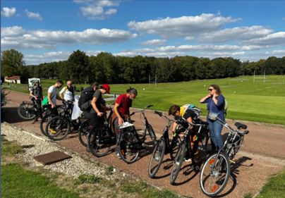

```{r setup, include=FALSE}
options(scipen=6)       # display digits proberly!! not the scientific version
options(digits.secs=6)  # use milliseconds in Date/Time data types
options(knitr.kable.NA = '-') #to hide NA values
options(tinytex.verbose = TRUE)
knitr::opts_chunk$set(
  echo    = FALSE,
  warning = FALSE,
  message = FALSE,
  fig.align = "center",
  fig.pos   = "H",
  eval.after = "fig.cap", # Pour évaluer du code R inline after dans le chunk
  out.extra = "",   # indispensable, sinon bookdown ignore fig.pos
  dpi=300, dev = "cairo_pdf",fig.path = "rapport_figs/"
)

# Pour intégrer la Police Marianne dans les graphiques/cartes
pacman::p_load(showtext)
font_add("Marianne", 
         regular = "fonts/Marianne/Marianne-Regular.ttf", 
         bold = "fonts/Marianne/Marianne-Bold.ttf", 
         italic = "fonts/Marianne/Marianne-LightItalic.ttf", 
         bolditalic = "fonts/Marianne/Marianne-BoldItalic.ttf", 
         )

showtext_auto() # Activer showtext pour tous les graphiques
showtext_opts(dpi = 300)# Synchroniser showtext avec le DPI de knitr


library(kableExtra)
library(readxl)
library(ggplot2)
```


# Titre 1
## Titre 2
### Titre 3
#### Titre 4

Lorem ipsum dolor sit amet, consectetur adipiscing elit. Donec arcu nisl, aliquet eu facilisis nec, consectetur vitae justo. In hac habitasse platea dictumst. Pellentesque consequat ex lobortis nulla gravida at feugiat neque aliquam. Curabitur consectetur varius metus ut dapibus. Quisque viverra lectus in orci fringilla suscipit.

Aliquam massa odio, placerat id vulputate eget, vehicula nec nisl. Duis nec mi aliquam, pellentesque purus ac, condimentum lacus. Vestibulum sed diam vestibulum efficitur velit nec, euismod ante. Praesent et dolor quis felis fermentum sagittis ultricies sit t est [@astruch_ecosystem-based_2025; @de_bettignies_indicateurs_2025].


* Premier élément
* Deuxième élément
* Troisième élément


Voici une liste:

* Item 1
* Item 2
    + Item 2a
    + Item 2b
    
    

## Image

```{r, fig.cap="PatriNat en sortie de service au Golf de l'Ailette (Aisne) — septembre 2022 © Jean-Baptiste Carriou.", out.width="78%"}

```

## Figure

```{r, fig.cap= "Graphique avec la police Marianne."}
ggplot(iris, aes(x = Sepal.Length, y = Sepal.Width)) +
  geom_point() +
  labs(title = "Exemple avec Marianne") +
  theme(text = element_text(family = "Marianne"))+
  theme_light()

```


## Tableau

```{r tab-exemple}
knitr::kable(
  head(iris[, 2:5], 5),
  caption = "Exemple de tableau — légende au-dessus",
  booktabs = TRUE
) |> 
  kable_styling(latex_options = "HOLD_position")
```


\newpage

#### Titre 4

Lorem ipsum dolor sit amet, consectetur adipiscing elit. Donec arcu nisl, aliquet eu facilisis nec, consectetur vitae justo. In hac habitasse platea dictumst. Pellentesque consequat ex lobortis nulla gravida at feugiat neque aliquam. Curabitur consectetur varius metus ut dapibus. Quisque viverra lectus in orci fringilla suscipit.

Aliquam massa odio, placerat id vulputate eget, vehicula nec nisl. Duis nec mi aliquam, pellentesque purus ac, condimentum lacus. Vestibulum sed diam vestibulum efficitur velit nec, euismod ante. Praesent et dolor quis felis fermentum sagittis ultricies sit t est.


\newpage

\addtocontents{toc}{\protect\setcounter{tocdepth}{2}}

# Annexes {.unnumbered}

## Annexe 1 : Liste des acronymes. {#annexe-1-liste-des-acronymes .unnumbered}

```{r , result= "asis"}
test <- read_excel("data/acro.xlsx")
test |> 
  # mutate_all(linebreak) |>
  knitr::kable(caption = 'Acronymes utilisés',
               longtable = TRUE, # Cette option permet indirectement de placer exactement la table ICI comme option old position, puis mets un espace sous le titre
               escape= FALSE,format = "latex",booktabs = TRUE)  
  # kable_styling(latex_options = c("striped","repeat_header")
```

\newpage
\clearpage

# Références {.unnumbered}


